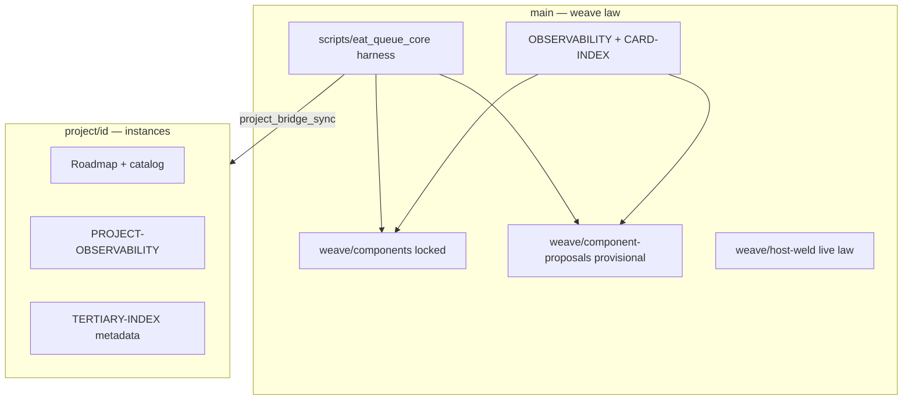

# Architecture overview

## One-sentence summary

**Trinity-Weave** ships the **maintenance and governance layer** for an agentic Second Brain: YAML cards describe behavior, Python harnesses align code to cards, and a schedule tick keeps the public surface current.

## System map

## Core concepts

| Concept | What it is |
|---------|------------|
| **Trinity card** | One YAML file with four legs: conceptual (intent), touch (code paths), rules, contract (tests/proofs) |
| **Locked vs provisional** | Locked under `weave/components/`; provisional under `weave/component-proposals/` — both are active law; provisional may evolve |
| **Maintenance core** | Registry-listed card ids frozen against autonomous mutation |
| **Harness** | `python3 -m scripts.eat_queue_core.harness <subcommand>` |
| **Schedule tick** | Background planes; change-gated public sync when weave fingerprints move |
| **Host-weld** | Compiled execution-safety law (`weave/host-weld/live/`) |
| **Project branch** | `project/<id>` — instances only; never merge into `main` |

## Data flow: public export

1. Weave files change in the operator workspace
2. Fingerprint change detected on allowlisted paths
3. `weave_public_sync` copies allowlist → Trinity-Weave export checkout (`main`)
4. Commit + push (when push budget allows)
5. Grok reads committed state only

Project instances follow the same idea via `project_bridge_sync` onto `project/<id>`.

## What is intentionally missing

- Live queue JSONL and Watcher tails
- Unpublished local paths and fulfill resolve maps
- Game/application source trees

## Dependencies

- Python 3.10+
- `pydantic`, `pyyaml` (`scripts/eat_queue_core/requirements.txt`)
- This clone is **read-only context** for Grok; harness runs against the operator workspace
