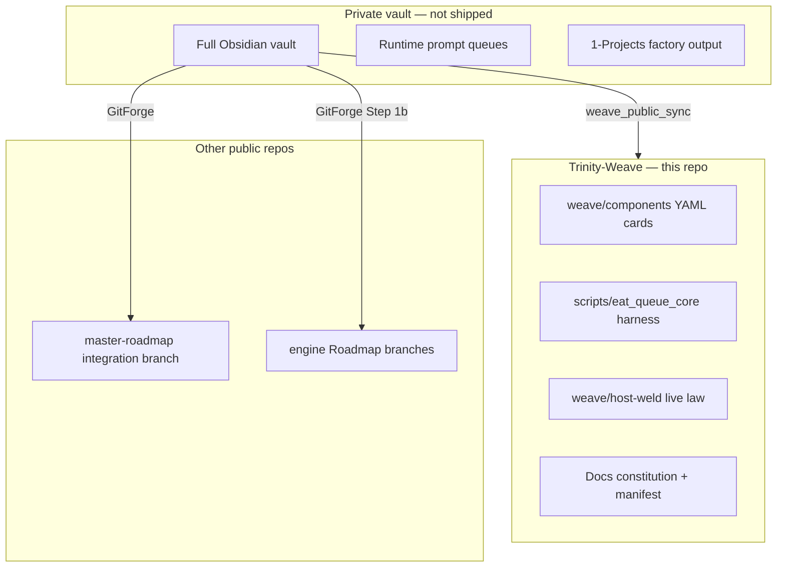

# Architecture overview (external readers)

## One-sentence summary

**Trinity-Weave** ships the **maintenance and governance layer** for an agentic Second Brain: YAML cards describe behavior, Python harnesses align code to cards, and a schedule tick runs background hygiene.

## System map

## Core concepts (minimal jargon)

| Concept | What it is |
|---------|------------|
| **Trinity card** | One YAML file (`weave/components/<id>.yaml`) with four legs: conceptual (intent), touch (code paths), rules (forbidden/precedence), contract (tests/proofs) |
| **Maintenance core** | Registry-listed card ids frozen against autonomous mutation; operator edits via `--operator-mutation` |
| **Harness** | `python3 -m scripts.eat_queue_core.harness <subcommand>` — CLI for align, self-wrap, publish, schedule |
| **Schedule tick** | Background listener/scheduled/reactive/graduation planes; includes Trinity-Weave auto-publish when weave files change |
| **Host-weld** | Compiled execution-safety law (`weave/host-weld/live/`) consumed by Cursor sessions |

## Data flow: public export

1. Operator edits weave files in private vault
2. `schedule_tick` listener detects fingerprint change on allowlisted paths
3. `weave_public_sync` copies allowlist → `trinity-weave-export` checkout
4. Git commit + push to GitHub `main`
5. Grok reads committed state only

## What is intentionally missing

- Project notes, Roadmaps, Ingest captures (factory output)
- `.cursor/` agents/rules/skills (on integration mirror repo)
- Runtime queue JSONL, lane board live state, Watcher append-only logs

## Dependencies

- Python 3.10+
- `pydantic`, `pyyaml` (`scripts/eat_queue_core/requirements.txt`)
- Assumes vault layout when run locally; **this repo is read-only context for Grok**

## Related repositories

| Repo | Role |
|------|------|
| [Trinity-Weave](https://github.com/L0RDTH0TH/Trinity-Weave) | Weave design (this) |
| [genesis-mythos-master-roadmap](https://github.com/L0RDTH0TH/genesis-mythos-master-roadmap) | Queue/automation ops + engine Roadmaps |
| Curator (private) | Full vault backup |
