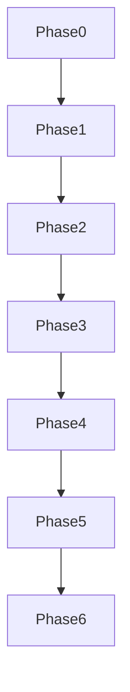

# Distilled core — genesis-mythos-master

## Phase 0 anchors

- Master goal: [[genesis-mythos-master-goal]]
- Roadmap state: [[roadmap-state]]
- Workflow state: [[workflow_state]]
- Decisions log: [[decisions-log]]
- Master roadmap: [[genesis-mythos-master-Roadmap-2026-06-26-0914]] (generation complete 2026-06-26)

## Core decisions (🔵)

- **2026-08-01 three-layer delivery:** System + Reference Exemplar + Operator modularity — [[genesis-mythos-master-goal]]; CDR [[Conceptual-Decision-Records/reference-exemplar-dual-goal-2026-08-01]]; charter [[REFERENCE-EXEMPLAR-CHARTER]]; Phase 6 triad + [[Phase-6-4-Reference-Exemplar-Roadmap-2026-08-01|6.4]] (manual mint; deepen skipped); UX mint addition-only.
- Phase 0: Roadmap tree generated from PMG — six phase primaries + MOC; factory artifacts deferred to Half A (ROADMAP_FACTORY_RELAUNCH).

## Phase 1 anchors

- Phase 1 primary: [[Phase-1-Conceptual-Foundation-and-Core-Architecture-Roadmap-2026-06-26-0914]] — **conceptual_map roll-up exempt reconcile** 2026-06-29 (`architect-rr-gmm-remi-e413f534`; `phase1_roll_up_exempt`; handoff_readiness 82; `conceptual_map_strict_gate` pass); **primary body compact** 2026-06-29 (`architect-rr-gmm-remi-phase1-primary-oversize`; body 1968<=2000; rollup [[Phase-1-Conceptual-Foundation-and-Core-Architecture-Roll-up-2026-06-29]]; primary oversize cleared; **1.2.1 compact GREEN** 2026-06-29).
- Phase 1 scope boundary — layer decoupling + proc-gen graph + modularity seams; **excludes** implementation detail, factory catalog rows, and execution rollup gates (deferred to execution track / Half A).
- **1.1 Layer decoupling:** WorldState, Simulation, Presentation, InputIntent; session-scoped composer; canon read-only gate; bus categories `canon.*` / `sim.*` / `session.*` / `presentation.*` — [[Phase-1-1-Layer-Decoupling-and-Interface-Contracts-Roadmap-2026-06-26-1200]] — **factory feed gate reconcile** 2026-06-29 (`architect-rr-gmm-remi-e5139d12`; `handoff_readiness: 78`; `factory_feedstock_slice: phase_1_secondary_tree`; `factory_feed_gate: qualified_secondary`; primary `handoff_readiness: 82` roll-up exempt — child 78 hostile ceiling; CDR [[Conceptual-Decision-Records/deepen-phase-1-1-factory-feed-gate-2026-06-29-0728]])
- **1.1.1 SessionComposer + LayerGraph:** SessionComposer wiring authority; LayerGraph mandatory four-layer slots; degraded session `session.degraded`; no global autoload gameplay loops — [[Phase-1-1-1-Session-Composer-and-Layer-Graph-Bootstrap-Roadmap-2026-06-29-0847]] — **factory feed tertiary mint** 2026-06-29 (`architect-rr-gmm-remi-phase1-11-tertiary`; `handoff_readiness: 77`; parent 1.1 `branch_open`; CDR [[Conceptual-Decision-Records/deepen-phase-1-1-1-session-composer-tertiary-2026-06-29-0847]]; validator [[.technical/parallel/godot/Validator/validator-roadmap_handoff_auto-architect-rr-gmm-remi-phase1-11-tertiary-20260629T090000Z]]) — **body compact GREEN** 2026-06-29 (`godo-39466c0c4656`; body 5996→943; `handoff_readiness: 77`; rollup [[Phase-1-1-1-Session-Composer-and-Layer-Graph-Bootstrap-Roll-up-2026-06-29]]; `factory_feed_gate_status: green`; `conceptual_factory_feed_ready: pmg_phases`; CDR [[Conceptual-Decision-Records/deepen-phase-1-1-1-body-compact-2026-06-29-1650]]; validator [[.technical/parallel/godot/Validator/validator-roadmap_handoff_auto-godo-39466c0c4656-20260629T165000Z]]; IRA [[.technical/Internal-Repair-Agent/roadmap/2026-06/genesis-mythos-master-ira-call-1-godo-39466c0c4656.md]])
- **1.1.2 BusCategoryRegistry + CanonCommitBoundary:** Bus category registry (`canon.*` / `sim.*` / `session.*` / `presentation.*`); CanonCommitBoundary lifecycle `proposed → accepted → hooked → sim-active` (PMG-aligned); CanonValidator dry-run within `proposed` — [[Phase-1-1-2-Bus-Category-Registry-and-CanonCommitBoundary-Roadmap-2026-06-29-0932]] — **factory feed tertiary mint** 2026-06-29 (`architect-rr-gmm-remi-phase1-112-tertiary`; `handoff_readiness: 78`) — **body compact GREEN** 2026-06-29 (`architect-rr-gmm-remi-df6901a9-next`; body 7616→938; rollup [[Phase-1-1-2-Bus-Category-Registry-and-CanonCommitBoundary-Roll-up-2026-06-29]]; `factory_feed_gate_status: green`; CDR [[Conceptual-Decision-Records/deepen-phase-1-1-2-body-compact-2026-06-29-1624]]; validator [[.technical/parallel/godot/Validator/validator-roadmap_handoff_auto-architect-rr-gmm-remi-df6901a9-next-20260629T162500Z]]; IRA [[.technical/Internal-Repair-Agent/roadmap/2026-06/genesis-mythos-master-ira-call-1-architect-rr-gmm-remi-df6901a9-next.md]])
- **1.1.3 Per-layer interface contract tables:** Four authoritative contract tables (WorldState, Simulation, Presentation, InputIntent) + seven cross-layer invariants; **1.1 branch closed** — [[Phase-1-1-3-Per-Layer-Interface-Contract-Tables-Roadmap-2026-06-29-1007]] — **factory feed tertiary mint** 2026-06-29 (`architect-rr-gmm-remi-phase1-113-tertiary`; `handoff_readiness: 80`) — **body compact GREEN** 2026-06-29 (`resume-factory-continue-gmm-post-111-compact-20260629T165700Z`; body 12320→1051; rollup [[Phase-1-1-3-Per-Layer-Interface-Contract-Tables-Roll-up-2026-06-29]]; `factory_feed_gate_status: green`; `conceptual_factory_feed_ready: pmg_phases`; CDR [[Conceptual-Decision-Records/deepen-phase-1-1-3-body-compact-2026-06-29-1710]]; validator [[.technical/parallel/godot/Validator/validator-roadmap_handoff_auto-resume-factory-continue-gmm-post-111-compact-20260629T165700Z-20260629T171500Z]]; IRA [[.technical/Internal-Repair-Agent/roadmap/2026-06/genesis-mythos-master-ira-call-1-resume-factory-continue-gmm-post-111-compact-20260629T165700Z.md]])
- **1.2 Proc-gen DAG + intent pipeline:** SeedBundle → stage DAG → DeterministicCompiler → CompiledWorldManifest; IntentResolver + LoreHookRegistry; tertiaries **1.2.1 + 1.2.2 feedstock complete** — **1.2 branch closed** 2026-06-29 — [[Phase-1-2-Procedural-Generation-Graph-and-Intent-Population-Pipeline-Roadmap-2026-06-26-1022]] — **factory feed gate reconcile** 2026-06-29 (`architect-rr-gmm-remi-phase1-12-feedstock`; `handoff_readiness: 79`; `factory_feedstock_slice: phase_1_secondary_tree`; `factory_feed_gate: qualified_secondary`; primary `handoff_readiness: 82` roll-up exempt — child 79 hostile ceiling +1 for tertiary coverage; CDR [[Conceptual-Decision-Records/deepen-phase-1-2-factory-feed-gate-2026-06-29-0800]])
- Primary container synced post-1.1 (interfaces + scope); task 1 satisfied; 1.2 minted 2026-06-26; **1.2 branch closed** (1.2.1 + 1.2.2 feedstock complete); **1.3 minted** — Phase 1 breadth complete.
- **1.2 Proc-gen DAG + intent pipeline:** Stage DAG (SeedBundle → terrain → biomes → POIs → entities → sim_bootstrap → CompiledWorldManifest); ToneProfileInjector cross-cutting; IntentResolver via CanonCommitBoundary → LoreHookRegistry; DeterministicCompiler first-class requirement — [[Phase-1-2-Procedural-Generation-Graph-and-Intent-Population-Pipeline-Roadmap-2026-06-26-1022]]
- **1.2.1 Stage DAG node contracts:** Per-stage contract tables + StageDAG edge registry + ToneProfile injection point registry; `handoff_readiness: 80`; `progress: 100` — **factory feed tertiary feedstock** 2026-06-29 (`architect-rr-gmm-remi-c3678396`; CDR [[Conceptual-Decision-Records/deepen-phase-1-2-1-stage-dag-node-contracts-feedstock-2026-06-29-1230]]; validator [[.technical/parallel/godot/Validator/validator-roadmap_handoff_auto-architect-rr-gmm-remi-c3678396-20260629T123658Z]]; IRA [[.technical/Internal-Repair-Agent/roadmap/2026-06/genesis-mythos-master-ira-call-1-architect-rr-gmm-remi-c3678396.md]]) — **body compact GREEN** 2026-06-29 (`resume-deepen-gmm-121-compact`; body 1077; rollup [[Phase-1-2-1-Stage-DAG-Node-Contracts-Roll-up-2026-06-29]]; CDR [[Conceptual-Decision-Records/deepen-phase-1-2-1-body-compact-2026-06-29-1400]]; validator [[.technical/parallel/godot/Validator/validator-roadmap_handoff_auto-resume-deepen-gmm-121-compact-20260629T131500Z-20260629T141500Z]]; IRA [[.technical/Internal-Repair-Agent/roadmap/2026-06/genesis-mythos-master-ira-call-1-resume-deepen-gmm-121-compact-20260629T131500Z.md]]) — [[Phase-1-2-1-Stage-DAG-Node-Contracts-Roadmap-2026-06-26-1105]]
- **1.3 Modularity seams + safety invariants:** SeamRegistry (generation/rule/bus/input ports); SeedSnapshot + DryRunValidator + ProvenanceEnvelope — [[Phase-1-3-Modularity-Seams-and-Safety-Invariants-Roadmap-2026-06-26-1437]] — **factory feed gate reconcile** 2026-06-29 (`architect-rr-gmm-remi-phase1-13-feedstock`; `handoff_readiness: 80`; `factory_feedstock_slice: phase_1_secondary_tree`; `factory_feed_gate: qualified_secondary`; `phase_1_secondary_tree_complete: true`; primary `handoff_readiness: 82` roll-up exempt — child 80 hostile ceiling + secondary tree closure; CDR [[Conceptual-Decision-Records/deepen-phase-1-3-factory-feed-gate-2026-06-29-0830]])
- **1.3.1 SeamRegistry canonical index:** Twelve-row seed catalog (`gen.stage.*`, `rule.*`, `bus.*`, `input.*`); PortBinder session-scoped; **1.3 branch closed** — [[Phase-1-3-1-SeamRegistry-Canonical-Index-Roadmap-2026-06-29-1037]] — **factory feed tertiary mint** 2026-06-29 (`architect-rr-gmm-remi-phase1-131-tertiary`; `handoff_readiness: 78`; CDR [[Conceptual-Decision-Records/deepen-phase-1-3-1-seam-registry-canonical-index-2026-06-29-1037]]; validator [[.technical/parallel/godot/Validator/validator-roadmap_handoff_auto-architect-rr-gmm-remi-phase1-131-tertiary-20260629T104056Z]]; IRA [[.technical/Internal-Repair-Agent/roadmap/2026-06/genesis-mythos-master-ira-call-1-architect-rr-gmm-remi-phase1-131-tertiary.md]]) — **body compact GREEN** 2026-06-29 (`godo-8ebf8470a075`; body 9923→1112; rollup [[Phase-1-3-1-SeamRegistry-Canonical-Index-Roll-up-2026-06-29]]; `factory_feed_gate_status: green`; CDR [[Conceptual-Decision-Records/deepen-phase-1-3-1-body-compact-2026-06-29-1440]]; validator [[.technical/parallel/godot/Validator/validator-roadmap_handoff_auto-godo-8ebf8470a075-20260629T144500Z]]; IRA [[.technical/Internal-Repair-Agent/roadmap/2026-06/genesis-mythos-master-ira-call-1-godo-8ebf8470a075.md]])
- **1.3.2 SeedSnapshotAuthority contract:** Eight-field SeedSnapshot schema + trigger matrix; capture → seal ordering gated on published SeamRegistry; **1.3 branch closed** — [[Phase-1-3-2-SeedSnapshotAuthority-Contract-Roadmap-2026-06-29-1110]] — **factory feed tertiary mint** 2026-06-29 (`architect-rr-gmm-remi-phase1-132-tertiary`; `handoff_readiness: 79`; CDR [[Conceptual-Decision-Records/deepen-phase-1-3-2-seed-snapshot-authority-contract-2026-06-29-1110]]; validator [[.technical/parallel/godot/Validator/validator-roadmap_handoff_auto-architect-rr-gmm-remi-phase1-132-tertiary-20260629T111530Z]]; IRA [[.technical/Internal-Repair-Agent/roadmap/2026-06/genesis-mythos-master-ira-call-1-architect-rr-gmm-remi-phase1-132-tertiary.md]]) — **body compact GREEN** 2026-06-29 (`godo-260f2dcd0e4e`; body 9175→813; rollup [[Phase-1-3-2-SeedSnapshotAuthority-Contract-Roll-up-2026-06-29]]; `factory_feed_gate_status: green`; CDR [[Conceptual-Decision-Records/deepen-phase-1-3-2-body-compact-2026-06-29-1530]]; validator [[.technical/parallel/godot/Validator/validator-roadmap_handoff_auto-godo-260f2dcd0e4e-20260629T154500Z]]; IRA [[.technical/Internal-Repair-Agent/roadmap/2026-06/genesis-mythos-master-ira-call-1-godo-260f2dcd0e4e.md]])
- **1.3.3 DryRunValidator + ProvenanceEnvelope contract:** Eight-row gate matrix (estimate-only compile branch) + seven-check catalog + twelve-field ProvenanceEnvelope schema; **1.3 branch closed** — [[Phase-1-3-3-DryRunValidator-and-ProvenanceEnvelope-Contract-Roadmap-2026-06-29-1205]] — **factory feed tertiary mint** 2026-06-29 (`architect-rr-gmm-remi-phase1-133-tertiary`; `handoff_readiness: 80`; `phase_1_tertiary_tree_complete: true`; CDR [[Conceptual-Decision-Records/deepen-phase-1-3-3-dry-run-validator-provenance-envelope-2026-06-29-1205]]; validator [[.technical/parallel/godot/Validator/validator-roadmap_handoff_auto-architect-rr-gmm-remi-phase1-133-tertiary-20260629T114421Z]]; IRA [[.technical/Internal-Repair-Agent/roadmap/2026-06/genesis-mythos-master-ira-call-1-architect-rr-gmm-remi-phase1-133-tertiary.md]]) — **body compact GREEN** 2026-06-29 (`architect-rr-gmm-remi-a0168226`; body 11833→1078; rollup [[Phase-1-3-3-DryRunValidator-and-ProvenanceEnvelope-Contract-Roll-up-2026-06-29]]; `factory_feed_gate_status: green`; `conceptual_factory_feed_ready: pmg_phases`; CDR [[Conceptual-Decision-Records/deepen-phase-1-3-3-body-compact-2026-06-29-1600]]; validator [[.technical/parallel/godot/Validator/validator-roadmap_handoff_auto-architect-rr-gmm-remi-a0168226-20260629T163000Z]]; IRA [[.technical/Internal-Repair-Agent/roadmap/2026-06/genesis-mythos-master-ira-call-1-architect-rr-gmm-remi-a0168226.md]])
- **1.2.2 Intent pipeline decomposition:** LoreHookRegistry typed schema (faction_seed/tribe_seed/npc_hook) + per-stage IntentResolver cross-cut tables + Handoff readiness; `handoff_readiness: 80`; `progress: 100`; **1.2 branch closed** — **factory feed tertiary feedstock** 2026-06-29 (`resume-deepen-gmm-122-20260629T125200Z`; CDR [[Conceptual-Decision-Records/deepen-phase-1-2-2-intent-pipeline-decomposition-feedstock-2026-06-29-1255]]; validator [[.technical/parallel/godot/Validator/validator-roadmap_handoff_auto-resume-deepen-gmm-122-20260629T125200Z-20260629T130428Z]]; IRA [[.technical/Internal-Repair-Agent/roadmap/2026-06/genesis-mythos-master-ira-call-1-resume-deepen-gmm-122-20260629T125200Z.md]]; **1.2.1 compact GREEN** superseded prior oversize blocker; persona: half_a.conceptual_architect) — **body compact GREEN** 2026-06-29 (`resume-factory-continue-gmm-post-121-compact-20260629T141500Z`; body 13956→1132; rollup [[Phase-1-2-2-Intent-Pipeline-Decomposition-Roll-up-2026-06-29]]; `factory_feed_gate_status: green`; CDR [[Conceptual-Decision-Records/deepen-phase-1-2-2-body-compact-2026-06-29-1415]]; validator [[.technical/parallel/godot/Validator/validator-roadmap_handoff_auto-resume-factory-continue-gmm-post-121-compact-20260629T141500Z-20260629T143200Z]]; IRA [[.technical/Internal-Repair-Agent/roadmap/2026-06/genesis-mythos-master-ira-call-1-resume-factory-continue-gmm-post-121-compact-20260629T141500Z.md]]) — [[Phase-1-2-2-Intent-Pipeline-Decomposition-Roadmap-2026-06-26-1335]]

## Phase 2 anchors

- Phase 2 primary: [[Phase-2-Procedural-Generation-and-World-Building-Roadmap-2026-06-26-0914]] — 2.1–2.3 secondaries minted; **conceptual_map roll-up reconcile** 2026-06-28 (architect-rr-gmm-remi-b90524f5; NL completeness + execution-deferred roll-up gates; handoff_readiness 83); **factory feed secondary tree reconcile** 2026-06-29 (`architect-rr-gmm-remi-bd350a64`; `phase_2_secondary_tree_complete: true`; gate advanced `conceptual_tertiary_tree_incomplete:phase_2`; factory feed **RED** until Phase 2 tertiaries).
- **2.1 Generation pipeline stages:** SeedParser → stage executors (terrain→sim_bootstrap) + CollaborativeRefinementLoop + DryRunValidator gates — [[Phase-2-1-Generation-Pipeline-Stages-Roadmap-2026-06-26-1515]] — **factory feed gate reconcile** 2026-06-29 (`architect-rr-gmm-remi-bd350a64`; `handoff_readiness: 78`; `factory_feedstock_slice: phase_2_secondary_tree`; `factory_feed_gate: qualified_secondary`; primary `handoff_readiness: 83` roll-up reconcile — child 78 hostile ceiling; CDR [[Conceptual-Decision-Records/deepen-phase-2-secondary-tree-factory-feed-gate-2026-06-29-1815]]; validator [[.technical/parallel/godot/Validator/validator-roadmap_handoff_auto-architect-rr-gmm-remi-bd350a64-20260629T182000Z]]; IRA [[.technical/Internal-Repair-Agent/roadmap/2026-06/genesis-mythos-master-ira-call-1-architect-rr-gmm-remi-bd350a64.md]])
- **2.1.1 CollaborativeRefinementLoop pause-point registry:** PausePointRegistry + RevisionAcceptancePolicy + default pause slots — [[Phase-2-1-1-CollaborativeRefinementLoop-Pause-Point-Registry-Roadmap-2026-06-29-1830]] — **body compact GREEN** 2026-06-29 (`architect-rr-gmm-remi-phase2-211-compact-20260629`; body 7736→1121; rollup [[Phase-2-1-1-CollaborativeRefinementLoop-Pause-Point-Registry-Roll-up-2026-06-29]]; `factory_feed_gate_status: green` 2.1.1 slice; CDR [[Conceptual-Decision-Records/deepen-phase-2-1-1-body-compact-2026-06-29-2022]]; validator [[.technical/parallel/godot/Validator/validator-roadmap_handoff_auto-architect-rr-gmm-remi-phase2-211-compact-20260629-20260629T194050Z]]; IRA [[.technical/Internal-Repair-Agent/roadmap/2026-06/genesis-mythos-master-ira-call-1-architect-rr-gmm-remi-phase2-211-compact-20260629.md]]; prior mint [[Conceptual-Decision-Records/deepen-phase-2-1-1-collaborative-refinement-pause-registry-2026-06-29-1830]])
- **2.2 Canon registry + intent resolver:** CanonRegistry + IntentResolver + LoreHookRegistry; CanonFact lifecycle; ConflictArbiter; RegistrySnapshot — [[Phase-2-2-Canon-Registry-and-Intent-Resolver-Roadmap-2026-06-26-1530]] — **factory feed gate reconcile** 2026-06-29 (`architect-rr-gmm-remi-bd350a64`; `handoff_readiness: 79`; `factory_feedstock_slice: phase_2_secondary_tree`; `factory_feed_gate: qualified_secondary`; primary `handoff_readiness: 83` roll-up reconcile — child 79 hostile ceiling; CDR [[Conceptual-Decision-Records/deepen-phase-2-secondary-tree-factory-feed-gate-2026-06-29-1815]]; validator [[.technical/parallel/godot/Validator/validator-roadmap_handoff_auto-architect-rr-gmm-remi-bd350a64-20260629T182000Z]]; IRA [[.technical/Internal-Repair-Agent/roadmap/2026-06/genesis-mythos-master-ira-call-1-architect-rr-gmm-remi-bd350a64.md]])
- **2.2.1 ConflictArbiter resolution policy:** Resolution modes + MergeTablePolicy + conflict-class bindings — [[Phase-2-2-1-ConflictArbiter-Resolution-Policy-Roadmap-2026-06-29-2000]] — **factory feed tertiary mint** 2026-06-29 (`architect-rr-gmm-remi-phase2-tertiary-next-20260629`; `handoff_readiness: 80`; `factory_feedstock_slice: phase_2_tertiary_tree`; CDR [[Conceptual-Decision-Records/deepen-phase-2-2-1-conflict-arbiter-resolution-policy-2026-06-29-2000]]; validator [[.technical/parallel/godot/Validator/validator-roadmap_handoff_auto-architect-rr-gmm-remi-phase2-tertiary-next-20260629-20260629T201500Z]]; IRA [[.technical/Internal-Repair-Agent/roadmap/2026-06/genesis-mythos-master-ira-call-1-architect-rr-gmm-remi-phase2-tertiary-next-20260629.md]]; persona: half_a.conceptual_architect) — **body compact GREEN** 2026-06-29 (`architect-rr-gmm-remi-phase2-221-compact-20260629`; body 8049→1188; rollup [[Phase-2-2-1-ConflictArbiter-Resolution-Policy-Roll-up-2026-06-29]]; `factory_feed_gate_status: green` (2.2.1 slice); CDR [[Conceptual-Decision-Records/deepen-phase-2-2-1-body-compact-2026-06-29-2030]]; validator [[.technical/parallel/godot/Validator/validator-roadmap_handoff_auto-architect-rr-gmm-remi-phase2-221-compact-20260629-20260629T205000Z]]; IRA [[.technical/Internal-Repair-Agent/roadmap/2026-06/genesis-mythos-master-ira-call-1-architect-rr-gmm-remi-phase2-221-compact-20260629.md]])
- **2.3.1 ProfileWeightManifest archetype tables:** ArchetypeRegistry index + six-namespace weight tables + PaletteVetoKey + ReceptiveNodeBinding index — [[Phase-2-3-1-ProfileWeightManifest-Archetype-Tables-Roadmap-2026-06-29-2115]] — **factory feed tertiary mint** 2026-06-29 (`architect-rr-gmm-remi-phase2-tertiary-next-20260629T211500Z`; `handoff_readiness: 80`; CDR [[Conceptual-Decision-Records/deepen-phase-2-3-1-profile-weight-manifest-archetype-tables-2026-06-29-2115]]; validator [[.technical/parallel/godot/Validator/validator-roadmap_handoff_auto-architect-rr-gmm-remi-phase2-tertiary-next-20260629T211500Z-20260629T211800Z]]; IRA [[.technical/Internal-Repair-Agent/roadmap/2026-06/genesis-mythos-master-ira-call-1-architect-rr-gmm-remi-phase2-tertiary-next-20260629T211500Z.md]]; persona: half_a.conceptual_architect) — **body compact GREEN** 2026-06-29 (`architect-rr-gmm-remi-phase2-231-compact-20260629T212800Z`; body 8670→1119; rollup [[Phase-2-3-1-ProfileWeightManifest-Archetype-Tables-Roll-up-2026-06-29]]; `factory_feed_gate_status: green` (2.3.1 slice); CDR [[Conceptual-Decision-Records/deepen-phase-2-3-1-body-compact-2026-06-29-2130]]; validator [[.technical/parallel/godot/Validator/validator-roadmap_handoff_auto-architect-rr-gmm-remi-phase2-231-compact-20260629T212800Z-20260629T213500Z]]; IRA [[.technical/Internal-Repair-Agent/roadmap/2026-06/genesis-mythos-master-ira-call-1-architect-rr-gmm-remi-phase2-231-compact-20260629T212800Z.md]])
- **2.3 ToneProfile bundle on world seed:** ToneProfileBundle + ArchetypeRegistry + ProfileWeightManifest; SeedBundle attachment; ToneCompatibilityGate at 2.2 — [[Phase-2-3-ToneProfile-Profile-Bundle-on-World-Seed-Roadmap-2026-06-26-1535]] — **factory feed gate reconcile** 2026-06-29 (`architect-rr-gmm-remi-bd350a64`; `handoff_readiness: 80`; `factory_feedstock_slice: phase_2_secondary_tree`; `phase_2_secondary_tree_complete: true`; `factory_feed_gate: qualified_secondary`; primary `handoff_readiness: 83` roll-up reconcile — child 80 hostile ceiling + secondary tree closure; CDR [[Conceptual-Decision-Records/deepen-phase-2-secondary-tree-factory-feed-gate-2026-06-29-1815]]; validator [[.technical/parallel/godot/Validator/validator-roadmap_handoff_auto-architect-rr-gmm-remi-bd350a64-20260629T182000Z]]; IRA [[.technical/Internal-Repair-Agent/roadmap/2026-06/genesis-mythos-master-ira-call-1-architect-rr-gmm-remi-bd350a64.md]])
- Phase 2 breadth closed 2026-06-26 (2.1–2.3); advance-phase 2→3 effective 15:40Z; Phase 3–5 progress tracked in Phase 3+ anchors below.
- Imports from Phase 1: SeamRegistry, stage DAG contracts (1.2.1), intent pipeline boundaries (1.2.2), SeedSnapshot/DryRunValidator (1.3).

## Phase 3 anchors

- Phase 3 primary: [[Phase-3-Living-Simulation-and-Dynamic-Agency-Roadmap-2026-06-26-0914]] — 3.1–3.3 secondaries minted; **conceptual_map roll-up reconcile** 2026-06-28 (architect-rr-gmm-remi-phase3-roll-up; NL completeness + execution-deferred roll-up gates; handoff_readiness 84); **factory feed secondary tree reconcile** 2026-06-29 (`godo-1b2f88b2381e`; `phase_3_secondary_tree_complete: true`; gate advanced `conceptual_tertiary_tree_incomplete:phase_3`; factory feed **RED** until Phase 3 tertiaries).
- **3.1 Tick-based simulation core:** SimClock, TickScheduler, SimTickPipeline, ConsequenceResolver + ToneProfileConsequenceWeights, WorldStateCommitter, WorldEventLog per-tick append, DMPauseGate — [[Phase-3-1-Tick-Based-Simulation-Core-Roadmap-2026-06-26-1600]] — **3.1.1 SimClock + TickScheduler policy** minted 2026-06-29 (`godo-1b2f88b2381e-next-phase3-tertiary`; `handoff_readiness: 79`; CDR [[Conceptual-Decision-Records/deepen-phase-3-1-1-sim-clock-tick-scheduler-policy-2026-06-29-2205]]) — **body compact GREEN** 2026-06-30 (`godo-phase3-tertiary-311-compact-20260630`; body 4840→1195; rollup [[Phase-3-1-1-SimClock-and-TickScheduler-Policy-Roll-up-2026-06-29]]; `factory_feed_gate_status: green`; CDR [[Conceptual-Decision-Records/deepen-phase-3-1-1-body-compact-2026-06-30-0210]]; validator [[.technical/parallel/godot/Validator/validator-roadmap_handoff_auto-godo-phase3-tertiary-311-compact-20260630-20260630T031800Z]]; IRA [[.technical/Internal-Repair-Agent/roadmap/2026-06/genesis-mythos-master-ira-call-1-godo-phase3-tertiary-311-compact-20260630.md]]); **3.1.2 WeatherSubsystem + RegionWeatherRegistry** minted 2026-06-29 (`godo-1b2f88b2381e-next-phase3-tertiary-3112`; `handoff_readiness: 80`; first **SimTickPipeline** slot; CDR [[Conceptual-Decision-Records/deepen-phase-3-1-2-weather-environmental-state-subsystem-2026-06-29-2230]]); **3.1.3 NPCAgendaSubsystem + LoreHookBindingIndex** minted 2026-06-29 (`godo-23ac6568adb3-next-phase3-tertiary-313`; `handoff_readiness: 80`; second **SimTickPipeline** slot; CDR [[Conceptual-Decision-Records/deepen-phase-3-1-3-npc-agendas-subsystem-2026-06-29-2330]]); **3.1.4 FactionGraphSubsystem + FactionGraphRegistry** minted 2026-06-30 (`godo-c5dfb6c9c49d-next-phase3-tertiary-314`; `handoff_readiness: 80`; third **SimTickPipeline** slot; CDR [[Conceptual-Decision-Records/deepen-phase-3-1-4-faction-graph-subsystem-2026-06-30-0015]]); secondary feedstock reconcile (`godo-1b2f88b2381e`; `handoff_readiness: 78`; `factory_feedstock_slice: phase_3_secondary_tree`)
- **3.2 Off-screen faction/tribe activity:** OffScreenActivityWindow, FactionGraphDeltaExtractor, SinceYouLeftCompiler, NarrativeSurfacingPolicy, AbsenceCatchupBridge — delta surfacing separate from **3.1** tick commit; **ThreadRevealGate** + **ToneProfileNarrativeWeights** — [[Phase-3-2-Off-Screen-Faction-Tribe-Activity-Roadmap-2026-06-26-1615]] — **factory feed gate reconcile** 2026-06-29 (`godo-1b2f88b2381e`; `handoff_readiness: 79`; `factory_feedstock_slice: phase_3_secondary_tree`; CDR [[Conceptual-Decision-Records/deepen-phase-3-secondary-tree-factory-feed-gate-2026-06-29-2145]]; validator [[.technical/parallel/godot/Validator/validator-roadmap_handoff_auto-godo-1b2f88b2381e-20260629T214500Z]]; IRA [[.technical/Internal-Repair-Agent/roadmap/2026-06/genesis-mythos-master-ira-call-1-godo-1b2f88b2381e.md]])
- **3.3 DM overwrite vs deliberate re-generation:** DMOverwriteClass (`live_patch` / `canon_touching_patch` / `structural_re_gen`), OverwritePatchLayer, ReGenerationIntentQueue, NarrativeDeltaVetoPolicy, RollbackWindow — policy matrix separates live flair from structural re-gen; **3.1**/**3.2** handoffs integrated — [[Phase-3-3-DM-Overwrite-vs-Deliberate-Re-Generation-Policy-Roadmap-2026-06-26-1630]] — **factory feed gate reconcile** 2026-06-29 (`godo-1b2f88b2381e`; `handoff_readiness: 80`; `factory_feedstock_slice: phase_3_secondary_tree`; `phase_3_secondary_tree_complete: true`; CDR [[Conceptual-Decision-Records/deepen-phase-3-secondary-tree-factory-feed-gate-2026-06-29-2145]]; validator [[.technical/parallel/godot/Validator/validator-roadmap_handoff_auto-godo-1b2f88b2381e-20260629T214500Z]]; IRA [[.technical/Internal-Repair-Agent/roadmap/2026-06/genesis-mythos-master-ira-call-1-godo-1b2f88b2381e.md]])
- Phase 3 breadth closed 2026-06-26 (3.1–3.3); advance-phase 3→4 effective 2026-06-26T16:41:00Z; **factory feed secondary tree qualified** 2026-06-29.
- Imports from Phase 2: SimGraphSeed, WorldEventLogInitializer (2.1); LoreHookRegistry sim-active (2.2); ToneProfileBundle weights (2.3).

## Phase 4 anchors

- **2026-07-16 Phase 4.2 secondary feedstock qualify GREEN:** handoff_readiness **80**; body **1355≤1400**; slice green; `phase_4_secondary_feedstock_qualified: 4.1,4.2,4.3`; project RED→Phase-5-1; queue `followup-deepen-phase42-20260716T190454Z`; CDR [[Conceptual-Decision-Records/deepen-phase-4-2-feedstock-qualify-2026-07-16-1527]]; validator [[.technical/parallel/godot/Validator/validator-roadmap_handoff_auto-followup-deepen-phase42-20260716T190454Z-20260716T193012Z.md]]; IRA [[.technical/Internal-Repair-Agent/roadmap/2026-07/genesis-mythos-master-ira-call-1-followup-deepen-phase42-20260716T190454Z.md]].

- **4.3.3 tertiary body recompact ≤1200 GREEN** (2026-07-16/17): AgencyPersistenceLedger / AbsentProxy / RailStatePersistence body **1412→1173≤1200**; queue `followup-deepen-gmm-4-3-3-20260717T033631Z`; CDR [[Conceptual-Decision-Records/deepen-phase-4-3-3-body-recompact-1200-2026-07-16-2341]]; rollup [[Phase-4-3-3-AgencyPersistenceLedger-AbsentProxy-and-RailStatePersistence-Roll-up-2026-07-16]]; slice feed gate green; Phase-4 tertiary recompact trail closed; historical RED Phase-5-1-2 cleared 1379→1197; live next DFS **5.1.3** (`1353>1200`).
- **4.3.2 tertiary body recompact ≤1200 GREEN** (2026-07-16/17): PilotMachineryGlue / PilotHandoffCoordinator body **1318→1189≤1200**; queue `followup-deepen-gmm-4-3-2-20260717T025252Z`; CDR [[Conceptual-Decision-Records/deepen-phase-4-3-2-body-recompact-1200-2026-07-16-2320]]; rollup [[Phase-4-3-2-PilotMachineryGlue-and-PilotHandoffCoordinator-Roll-up-2026-07-16]]; slice feed gate green; siblings 4.1.1=1068 / 4.1.2=1178 / 4.1.3=1155 / 4.2.1=1140 / 4.2.2=1033 / 4.2.3=1062 / 4.3.1=1158≤1200; historical RED Phase-5-1-2 cleared 1379→1197; live next DFS **5.1.3** (`1353>1200`).
- **4.3.1 tertiary body recompact ≤1200 GREEN** (2026-07-16/17): AgencyEnvelope / active_agency vs observe_only body **1273→1158≤1200**; queue `followup-deepen-gmm-4-2-3-20260716T232339Z` (layer1_redirect stale 4.2.3→live 4.3.1); CDR [[Conceptual-Decision-Records/deepen-phase-4-3-1-body-recompact-1200-2026-07-16-2236]]; rollup [[Phase-4-3-1-AgencyEnvelope-and-Active-Agency-Modes-Roll-up-2026-07-16]]; slice feed gate green; siblings 4.1.1=1068 / 4.1.2=1178 / 4.1.3=1155 / 4.2.1=1140 / 4.2.2=1033 / 4.2.3=1062≤1200; historical project RED Phase-4-3-2 `body_over_cap:1318>1200` (**cleared** 1318→1189); live next DFS **5.1.3** (`1353>1200`).
- **4.2.3 tertiary body recompact ≤1200 GREEN** (2026-07-16): DMRailUXContract / DM rail chrome body **1267→1060≤1200**; queue `followup-deepen-gmm-4-2-3-20260716T232339Z`; CDR [[Conceptual-Decision-Records/deepen-phase-4-2-3-body-recompact-1200-2026-07-16-1937]]; rollup [[Phase-4-2-3-DM-Rail-Chrome-and-DMRailUXContract-Roll-up-2026-07-16]]; slice feed gate green; siblings 4.1.1=1061 / 4.1.2=1176 / 4.1.3=1153 / 4.2.1=1138 / 4.2.2=1031≤1200; historical project RED Phase-4-3-2 `body_over_cap:1318>1200` (**cleared** 1318→1189); historical next was 4.3.1 (cleared 1273→1158); live next DFS **5.1.3** (`1353>1200`).
- **4.2.2 tertiary body recompact ≤1200 GREEN** (2026-07-16): MapAnnotationEnvelope body **1393→1032≤1200**; queue `followup-deepen-gmm-4-2-2-20260716T230307Z`; CDR [[Conceptual-Decision-Records/deepen-phase-4-2-2-body-recompact-1200-2026-07-16-1908]]; rollup [[Phase-4-2-2-Map-Annotation-Envelope-Roll-up-2026-07-16]]; slice feed gate green; siblings 4.1.1=1062 / 4.1.2=1177 / 4.1.3=1154 / 4.2.1=1139≤1200; historical project RED Phase-4-2-3 `body_over_cap:1268>1200` (cleared →1060); historical next 4.3.1 cleared; 4.3.2 cleared 1189≤1200; live next DFS **5.1.3** (`1353>1200`).
- **4.2.1 tertiary body recompact ≤1200 GREEN** (2026-07-16): TransitionGuardRegistry / DM session authority body **1381→1118≤1200**; queue `followup-deepen-gmm-4-2-1-20260716T222811Z`; CDR [[Conceptual-Decision-Records/deepen-phase-4-2-1-body-recompact-1200-2026-07-16-1850]]; rollup [[Phase-4-2-1-TransitionGuardRegistry-and-DM-Session-Authority-Roll-up-2026-07-16]]; slice feed gate green; siblings 4.1.1=1035 / 4.1.2=1176 / 4.1.3=1153≤1200; historical project RED Phase-4-2-2 `body_over_cap:1393>1200` (cleared →1032); historical next 4.3.1 cleared (4.2.3 cleared); 4.3.2 cleared 1189≤1200; live next DFS **5.1.3** (`1353>1200`).
- **4.1.3 tertiary body recompact ≤1200 GREEN** (2026-07-16): WorldCam / MapCam / SensoriumAttach FOV body **1331→1153≤1200**; queue `followup-deepen-gmm-4-1-3-20260716T220407Z`; CDR [[Conceptual-Decision-Records/deepen-phase-4-1-3-body-recompact-1200-2026-07-16-1814]]; rollup [[Phase-4-1-3-WorldCam-MapCam-and-SensoriumAttach-FOV-Roll-up-2026-07-16]]; slice feed gate green; siblings 4.1.1=1035 / 4.1.2=1176≤1200; historical next was Phase-4-2-1 (cleared 1381→1118) then Phase-4-2-2 (cleared 1393→1032) then Phase-4-2-3 (cleared 1267→1060); historical RED Phase-4-3-2 cleared 1189≤1200; live next DFS **5.1.3** (`1353>1200`).technical/parallel/godot/Validator/validator-roadmap_handoff_auto-followup-deepen-gmm-4-1-3-20260716T220407Z-20260716T221758Z.md]]; IRA [[.technical/Internal-Repair-Agent/roadmap/2026-07/genesis-mythos-master-ira-call-1-followup-deepen-gmm-4-1-3-20260716T220407Z.md]].
- **4.1.2 tertiary body recompact ≤1200 GREEN** (2026-07-16): UnifiedSceneGraph / CameraInterpolatorRegistry / PlayerFPRig body **1407→1188≤1200** (live post-scrub **1176**); queue `followup-deepen-gmm-4-1-2-20260716T213643Z`; CDR [[Conceptual-Decision-Records/deepen-phase-4-1-2-body-recompact-1200-2026-07-16-1750]]; rollup [[Phase-4-1-2-UnifiedSceneGraph-CameraInterpolatorRegistry-and-PlayerFPRig-Roll-up-2026-07-16]]; slice feed gate green; 4.1.1 live **1029≤1200**; historical next DFS was Phase-4-1-3 (cleared 1331→1153) then Phase-4-2-x trail cleared; historical next Phase-4-3-3 cleared; live next DFS **5.1.3** (`1353>1200`); validator [[.technical/parallel/godot/Validator/validator-roadmap_handoff_auto-followup-deepen-gmm-4-1-2-20260716T213643Z-20260716T215312Z.md]]; IRA [[.technical/Internal-Repair-Agent/roadmap/2026-07/genesis-mythos-master-ira-call-1-followup-deepen-gmm-4-1-2-20260716T213643Z.md]].
- **4.1.1 tertiary body recompact ≤1200 GREEN** (2026-07-16): PerspectiveEnvelope / ModeTransitionGraph / PilotGraph body **1400→1014** historical then live **1029≤1200** after sibling handoff update; queue `architect-rr-gmm-remi-fd0e8a04`; CDR [[Conceptual-Decision-Records/deepen-phase-4-1-1-body-recompact-1200-2026-07-16-1722]]; validator [[.technical/parallel/godot/Validator/validator-roadmap_handoff_auto-architect-rr-gmm-remi-fd0e8a04-20260716T212548Z.md]]; IRA [[.technical/Internal-Repair-Agent/roadmap/2026-07/genesis-mythos-master-ira-call-1-architect-rr-gmm-remi-fd0e8a04.md]]; slice feed gate green; next DFS advanced under tertiary 1200 cap trail (4.1.3 cleared → 4.2.1 cleared → 4.2.2).
- **4.1.1 tertiary mint GREEN** (2026-07-16): PerspectiveEnvelope / ModeTransitionGraph / PilotGraph body 1399≤1400 (superseded by ≤1200 recompact above); rollup [[Phase-4-1-1-PerspectiveEnvelope-ModeTransitionGraph-and-PilotGraph-Roll-up-2026-07-16]]; CDR [[Conceptual-Decision-Records/deepen-phase-4-1-1-perspective-envelope-2026-07-16-0812]].
- **4.1.2 tertiary mint** (2026-07-16): UnifiedSceneGraph / CameraInterpolatorRegistry / PlayerFPRig (mint epoch then recompact ≤1200 above); rollup [[Phase-4-1-2-UnifiedSceneGraph-CameraInterpolatorRegistry-and-PlayerFPRig-Roll-up-2026-07-16]]; CDR [[Conceptual-Decision-Records/deepen-phase-4-1-2-unified-scene-graph-2026-07-16-0828]].
- **4.1.3 tertiary mint GREEN** (2026-07-16): WorldCam / MapCam / SensoriumAttach FOV body 1376≤1400 (superseded by ≤1200 recompact above); rollup [[Phase-4-1-3-WorldCam-MapCam-and-SensoriumAttach-FOV-Roll-up-2026-07-16]]; CDR [[Conceptual-Decision-Records/deepen-phase-4-1-3-worldcam-mapcam-sensorium-fov-2026-07-16-0845]]; **4.1 tertiary branch closed**; **phase_4_tertiary_tree_complete**.
- **4.3.3 tertiary mint GREEN** (2026-07-16): AgencyPersistenceLedger / AbsentProxyPolicyTable / RailStatePersistence body 1388≤1400; rollup [[Phase-4-3-3-AgencyPersistenceLedger-AbsentProxy-and-RailStatePersistence-Roll-up-2026-07-16]]; CDR [[Conceptual-Decision-Records/deepen-phase-4-3-3-agency-persistence-ledger-2026-07-16-0749]]; slice feed gate green; **4.3 tertiary branch closed**; project RED phase_4_tertiary_tree; next 4.1.1 PerspectiveEnvelope / ModeTransitionGraph / PilotGraph.
- **4.3.2 tertiary mint GREEN** (2026-07-16): PilotMachineryGlue / PilotHandoffCoordinator body 1389≤1400; rollup [[Phase-4-3-2-PilotMachineryGlue-and-PilotHandoffCoordinator-Roll-up-2026-07-16]]; CDR [[Conceptual-Decision-Records/deepen-phase-4-3-2-pilot-machinery-glue-2026-07-16-0729]]; slice feed gate green; project RED phase_4_tertiary_tree; next 4.3.3 AgencyPersistenceLedger / AbsentProxy / RailStatePersistence.
- **4.3.1 tertiary mint GREEN** (2026-07-16): AgencyEnvelope / active_agency vs observe_only body 1295≤1400; rollup [[Phase-4-3-1-AgencyEnvelope-and-Active-Agency-Modes-Roll-up-2026-07-16]]; CDR [[Conceptual-Decision-Records/deepen-phase-4-3-1-agency-envelope-2026-07-16-0709]]; slice feed gate green; project RED phase_4_tertiary_tree; next 4.3.2 PilotMachineryGlue / PilotHandoffCoordinator.
- **4.2.3 tertiary mint GREEN** (2026-07-16): DMRailUXContract / DM rail chrome body 1298≤1400; rollup [[Phase-4-2-3-DM-Rail-Chrome-and-DMRailUXContract-Roll-up-2026-07-16]]; CDR [[Conceptual-Decision-Records/deepen-phase-4-2-3-dm-rail-ux-contract-2026-07-16-0653]]; slice feed gate green; 4.2 tertiary branch closed; project RED phase_4_tertiary_tree; next 4.3.1 AgencyEnvelope.
- **4.2.2 tertiary mint GREEN** (2026-07-16): MapAnnotationEnvelope body 1392≤1400; rollup [[Phase-4-2-2-Map-Annotation-Envelope-Roll-up-2026-07-16]]; CDR [[Conceptual-Decision-Records/deepen-phase-4-2-2-map-annotation-envelope-2026-07-16-0628]]; slice feed gate green; project RED phase_4_tertiary_tree; next 4.2.3 DM rail chrome.
- **4.2.1 tertiary compact GREEN** (2026-07-16): TransitionGuardRegistry + DM session authority body 3227→1380; rollup [[Phase-4-2-1-TransitionGuardRegistry-and-DM-Session-Authority-Roll-up-2026-07-16]]; CDR [[Conceptual-Decision-Records/deepen-phase-4-2-1-body-compact-2026-07-16-0614]]; slice feed gate green; project RED phase_4_tertiary_tree; report [[.technical/parallel/godot/Validator/validator-roadmap_handoff_auto-followup-deepen-phase42-feedstock-20260716T085600Z-20260716T101733Z.md]].

- Phase 4 primary: [[Phase-4-Perspective-Split-and-Control-Systems-Roadmap-2026-06-26-0914]] — 4.1–4.3 secondaries minted; **conceptual_map roll-up reconcile** 2026-06-28 (architect-rr-gmm-remi-phase4-roll-up; NL completeness + execution-deferred roll-up gates; handoff_readiness 85); **HANDOFF_AUDIT_REPAIR reconciled** 2026-06-28 (repair-handoff-audit-architect-rr-gmm-remi-phase4-p4-20260628T211800Z; validation_hygiene_phase4_tail reconciled; primary_code_active: missing_roll_up_gates; **conceptual_map_complete: closed** (global; Phase 6 roll-up architect-rr-gmm-remi-phase6-roll-up / roadmap-state L50)).
- **4.1 Player FP + perspective envelope:** PerspectiveEnvelope, UnifiedSceneGraph, CameraInterpolatorRegistry, PlayerFPRig, WorldCam/MapCam/SensoriumAttach, PilotGraph (dominate/absent-proxy), ModeTransitionGraph — [[Phase-4-1-Player-FP-and-Perspective-Envelope-Roadmap-2026-06-26-1705]]
- **4.2 DM rigs + mode transition graph:** DMRigPolicyMatrix, TransitionGuardRegistry, ModeTransitionGraph edge catalog — [[Phase-4-2-DM-Rigs-and-Mode-Transition-Graph-Roadmap-2026-06-26-1730]] — tertiaries [[Phase-4-2-1-TransitionGuardRegistry-and-DM-Session-Authority-Roadmap-2026-07-16-0456]], [[Phase-4-2-2-Map-Annotation-Envelope-Roadmap-2026-07-16-0628]], [[Phase-4-2-3-DM-Rail-Chrome-and-DMRailUXContract-Roadmap-2026-07-16-0653]] (4.2 branch closed)
- **4.3 Agency envelope + pilot machinery glue:** AgencyEnvelope, PilotMachineryGlue, PilotHandoffCoordinator, AgencyPersistenceLedger, DominateSessionBinding, passenger_fp_overlay hook — [[Phase-4-3-Agency-Envelope-and-Pilot-Machinery-Glue-Roadmap-2026-06-26-1945]]
- Phase 4 breadth closed 2026-06-26 (4.1–4.3); advance-phase 4→5 effective 2026-06-26T20:38:00Z.
- Imports from Phase 1: Presentation/InputIntent layers, `presentation.*` bus (1.1); from Phase 3: DMPauseGate, NarrativeDeltaVetoPolicy seams.

## Phase 5 anchors
- **2026-07-16 Phase 5.3 secondary feedstock qualify GREEN:** handoff_readiness **80**; body **1400≤1400**; `secondary_feedstock_qualified: true`; `phase_5_secondary_feedstock_qualified: 5.1,5.2,5.3`; `phase_5_secondary_tree_complete: true`; slice green; project RED next Phase-6-1 feedstock; CDR [[Conceptual-Decision-Records/deepen-phase-5-3-feedstock-qualify-2026-07-16-1615]]; queue followup-deepen-phase53-20260716T201302Z; validator [[.technical/parallel/godot/Validator/validator-roadmap_handoff_auto-followup-deepen-phase53-20260716T201302Z-20260716T201833Z.md]]; IRA [[.technical/Internal-Repair-Agent/roadmap/2026-07/genesis-mythos-master-ira-call-1-followup-deepen-phase53-20260716T201302Z.md]]
- **2026-07-16 Phase 5.1 secondary feedstock qualify GREEN:** handoff_readiness **80**; body **1391≤1400**; slice green; `phase_5_secondary_feedstock_qualified: 5.1`; project RED next Phase-5-2 feedstock; CDR [[Conceptual-Decision-Records/deepen-phase-5-1-feedstock-qualify-2026-07-16-1545]]; queue followup-deepen-phase51-20260716T193932Z

- **5.1.2 tertiary mint GREEN** (2026-07-16): RulesetPlugin / PluginHookManifest / PluginLoader body 1388≤1400; rollup [[Phase-5-1-2-RulesetPlugin-PluginHookManifest-and-PluginLoader-Roll-up-2026-07-16]]; CDR [[Conceptual-Decision-Records/deepen-phase-5-1-2-ruleset-plugin-2026-07-16-0928]]; slice feed gate green; project RED phase_5_tertiary_tree; **5.1.3 minted**; next 5.2.1 SpellAgencyPerspectiveManifest / SpellMetadataRegistry. validator report: [[.technical/parallel/godot/Validator/validator-roadmap_handoff_auto-followup-deepen-phase512-tertiary-20260716T132542Z-20260716T133240Z.md]]; ira: [[.technical/Internal-Repair-Agent/roadmap/2026-07/genesis-mythos-master-ira-call-1-followup-deepen-phase512-tertiary-20260716T132542Z.md]].
- **5.1.3 tertiary mint GREEN** (2026-07-16): RuleConflictArbiter / RuleEffectBus body 1398≤1400; rollup [[Phase-5-1-3-RuleConflictArbiter-and-RuleEffectBus-Roll-up-2026-07-16]]; CDR [[Conceptual-Decision-Records/deepen-phase-5-1-3-rule-conflict-arbiter-2026-07-16-0941]]; slice feed gate green; **5.1 tertiary branch closed**; project RED phase_5_tertiary_tree; next 5.2.1 SpellAgencyPerspectiveManifest / SpellMetadataRegistry. validator_first: needs_work; validator report: [[.technical/parallel/godot/Validator/validator-roadmap_handoff_auto-followup-deepen-phase513-tertiary-20260716T134105Z-20260716T134725Z.md]]; ira: [[.technical/Internal-Repair-Agent/roadmap/2026-07/genesis-mythos-master-ira-call-1-followup-deepen-phase513-tertiary-20260716T134105Z.md]]; second_pass: [[.technical/parallel/godot/Validator/validator-roadmap_handoff_auto-followup-deepen-phase513-tertiary-20260716T134105Z-20260716T135520Z-second-pass.md]]; balance_triad: deepen + ira_hygiene + deepen_complete on disk (FIX-008 via `repair-handoff-audit-phase513-20260716T140302Z`).
- **5.1.2 tertiary body recompact ≤1200 GREEN** (2026-07-17): RulesetPlugin / PluginHookManifest / PluginLoader body **1379→1197≤1200**; queue `followup-deepen-gmm-5-1-2-20260717T042415Z`; CDR [[Conceptual-Decision-Records/deepen-phase-5-1-2-body-recompact-1200-2026-07-17-0051]]; rollup [[Phase-5-1-2-RulesetPlugin-PluginHookManifest-and-PluginLoader-Roll-up-2026-07-16]]; slice feed gate green; Phase-4 tertiaries ≤1200 held; project RED Phase-5-1-3 `body_over_cap:1353>1200`; live next DFS **5.1.3** (`1353>1200`); validator [[.technical/parallel/godot/Validator/validator-roadmap_handoff_auto-followup-deepen-gmm-5-1-2-20260717T042415Z-20260717T045419Z.md]]; IRA [[.technical/Internal-Repair-Agent/roadmap/2026-07/genesis-mythos-master-ira-call-1-followup-deepen-gmm-5-1-2-20260717T042415Z.md]].
- **5.1.1 tertiary body recompact ≤1200 GREEN** (2026-07-17): RuleEngineCore / RulePrimitive / RuleContextFrame body **1415→1186≤1200**; queue `followup-deepen-gmm-5-1-1-20260717T035610Z`; CDR [[Conceptual-Decision-Records/deepen-phase-5-1-1-body-recompact-1200-2026-07-17-0009]]; rollup [[Phase-5-1-1-RuleEngineCore-RulePrimitive-and-RuleContextFrame-Roll-up-2026-07-16]]; slice feed gate green; historical RED Phase-5-1-2 cleared 1379→1197; live next DFS **5.1.3** `body_over_cap:1353>1200`; validator [[.technical/parallel/godot/Validator/validator-roadmap_handoff_auto-followup-deepen-gmm-5-1-1-20260717T035610Z-20260717T041247Z.md]]; IRA [[.technical/Internal-Repair-Agent/roadmap/2026-07/genesis-mythos-master-ira-call-1-followup-deepen-gmm-5-1-1-20260717T035610Z.md]].
- **5.1.1 tertiary mint GREEN** (2026-07-16): RuleEngineCore / RulePrimitive / RuleContextFrame body 1362≤1400; rollup [[Phase-5-1-1-RuleEngineCore-RulePrimitive-and-RuleContextFrame-Roll-up-2026-07-16]]; CDR [[Conceptual-Decision-Records/deepen-phase-5-1-1-rule-engine-core-2026-07-16-0910]]; slice feed gate green; project RED phase_5_tertiary_tree; **5.1.2 minted**; **5.1.3 minted**; next 5.2.1 SpellAgencyPerspectiveManifest / SpellMetadataRegistry.
- Phase 5 primary: [[Phase-5-Rule-System-Integration-and-Extensibility-Roadmap-2026-06-26-0914]] — 5.1–5.3 secondaries minted; **conceptual_map roll-up reconcile** 2026-06-28 (architect-rr-gmm-remi-phase5-roll-up; NL completeness + execution-deferred roll-up gates; handoff_readiness 84); **primary body compact** 2026-07-15 (`followup-deepen-phase5-primary-20260716T003545Z`; 7801→1918; rollup [[Phase-5-Rule-System-Integration-and-Extensibility-Roll-up-2026-07-15]]; factory_feed_gate GREEN slice; project cursor Phase-6-2-7 tertiary body_over_cap 10938>1400 (Phase-6-2-6 cleared 13344→1398; Phase-6-2-5 cleared 11488→1379; Phase-6-2-4 cleared 9540→1235; Phase-6-2-3 cleared 9450→1244; Phase-6-2-2 cleared 9495→1313; Phase-6-2-1 cleared 10479→1383) (Phase-6-1-3 cleared 8871→1197) (Phase-6-1-2 cleared 7707→1400; Phase-6-1-1 cleared 6283→1390; Phase-6-1 secondary cleared 12472→1348); Phase-6 primary cleared 8870→2000).
- **5.1 Rule engine primitives + plugin hooks:** RuleEngineCore, RulePrimitive library (condition/effect atoms), RulesetPlugin PluginHookManifest, PluginLoader (session-boundary), RuleConflictArbiter (priority-chain/veto/merge), RuleContextFrame (actor+scene+canon snapshot), RuleEffectBus (routes to 3.1/4.1/4.3 subsystems); session-boundary hot-swap policy locked conceptually; rule DSL execution-deferred (OQ-5.1-001) — [[Phase-5-1-Rule-Engine-Primitives-and-Plugin-Hooks-Roadmap-2026-06-26-2045]]
- **5.2 Spell agency + perspective metadata:** SpellAgencyPerspectiveManifest, SpellMetadataRegistry, DominateSpellBinding (`modify_agency` dominate/release), VictimPassengerOverlayBinding (`passenger_fp_overlay` hook), LiminalPresentationPolicy, spell trigger enum extension (`spell_cast_complete`, `spell_tick_sustain`, `spell_dispel`), DominateSessionBinding `spell_id` 4.3 extension — [[Phase-5-2-Spell-Agency-Perspective-Metadata-Roadmap-2026-06-26-2115]]
- **5.3 Quest pressure from canon graph:** QuestPressureManifest, CanonGraphPressureIndex, QuestPressureRulePlugin, RuleEffectBus `quest_pressure` channel, priority bands (spell 100–199, quest 200–299), `spell_interaction_policy` with 5.2 — [[Phase-5-3-Quest-Pressure-from-Canon-Graph-Roadmap-2026-06-26-2142]] — **factory feed secondary qualify GREEN** 2026-07-16 (`followup-deepen-phase53-20260716T201302Z`; `handoff_readiness: 80`; `secondary_feedstock_qualified: true`; CDR [[Conceptual-Decision-Records/deepen-phase-5-3-feedstock-qualify-2026-07-16-1615]])
- Phase 5 conceptual breadth closed 2026-06-26 (5.1–5.3); advance-phase 5→6 effective 2026-06-26T22:11:00Z.
- Imports from Phase 1: SeamRegistry rule seam family (1.3); from Phase 2: CanonRegistry/IntentResolver (2.2), ToneProfileBundle (2.3); from Phase 3: SimTickPipeline/WorldStateCommitter/DMPauseGate (3.1), ReGenerationIntentQueue (3.3); from Phase 4: PerspectiveEnvelope/CameraInterpolatorRegistry (4.1), ModeTransitionGraph guards (4.2), AgencyEnvelope/AgencyTransitionGuardExtension/PilotHandoffCoordinator (4.3).

## Phase 6 anchors

- Phase 6 primary: [[Phase-6-Prototype-Assembly-Testing-and-Iteration-Roadmap-2026-06-26-0914]] — prototype assembly, testing, iteration (dual-track: factory spine vs horizon demo v1); **conceptual_map roll-up reconcile** 2026-06-29 (architect-rr-gmm-remi-phase6-roll-up; NL completeness + execution-deferred roll-up gates; handoff_readiness 86; **conceptual_map_complete: closed**); **Architect planner reconcile no-op lineage** 2026-06-29 (`architect-rr-gmm-remi-23157c37` → `architect-rr-gmm-remi-17424164` → `architect-rr-gmm-remi-f21add4a` → `architect-rr-gmm-remi-8787c4d5` → `architect-rr-gmm-remi-e0fbbedc` → `architect-rr-gmm-remi-1d049243`; stale PQ red reconciled six times; global closed reaffirmed; no Phase-* remint; dedupe shield advisory); **primary body compact** 2026-07-15 (`followup-deepen-phase6-primary-20260716T010600Z`; 8870→2000; rollup [[Phase-6-Prototype-Assembly-Testing-and-Iteration-Roll-up-2026-07-15]]; factory_feed_gate GREEN slice; project cursor Phase-6-2-7 tertiary body_over_cap 10938>1400 (Phase-6-2-6 cleared 13344→1398; Phase-6-2-5 cleared 11488→1379; Phase-6-2-4 cleared 9540→1235; Phase-6-2-3 cleared 9450→1244; Phase-6-2-2 cleared 9495→1313; Phase-6-2-1 cleared 10479→1383) (Phase-6-1-3 cleared 8871→1197) (Phase-6-1-2 cleared 7707→1400; Phase-6-1-1 cleared 6283→1390) (Phase-6-1 secondary cleared 12472→1348)).
- **6.1 Factory Phase 0 presentation shell:** PresentationShellManifest + LaunchFlowController + PlayRegionHost + HUDLayerStack + KinestheticHonestyChecklist + DevLeakageGuard; launch → PlayRegion → HUD; factory spine NOT horizon demo — [[Phase-6-1-Factory-Phase-0-Presentation-Shell-Roadmap-2026-06-26-1912]]; **secondary body compact** 2026-07-15 (`followup-deepen-phase61-secondary-20260716T012010Z`; 12472→1348; rollup [[Phase-6-1-Factory-Phase-0-Presentation-Shell-Roll-up-2026-07-15]]; factory_feed_gate GREEN slice; project cursor Phase-6-2-7 tertiary body_over_cap 10938>1400 (Phase-6-2-6 cleared 13344→1398; Phase-6-2-5 cleared 11488→1379; Phase-6-2-4 cleared 9540→1235; Phase-6-2-3 cleared 9450→1244; Phase-6-2-2 cleared 9495→1313; Phase-6-2-1 cleared 10479→1383) (Phase-6-1-3 cleared 8871→1197) (Phase-6-1-2 cleared 7707→1400; Phase-6-1-1 cleared 6283→1390)); **6.1.1** launch/bootstrap decomposition — [[Phase-6-1-1-Launch-Flow-and-DevLeakageGuard-Session-Bootstrap-Roadmap-2026-06-27-0406]]; **6.1.2** PlayRegionHost mount lifecycle — [[Phase-6-1-2-PlayRegionHost-Mount-Lifecycle-Roadmap-2026-06-27-0431]]; **6.1.3** HUDLayerStack + KinestheticHonestyChecklist — [[Phase-6-1-3-HUDLayerStack-and-Kinesthetic-Honesty-Checklist-Roadmap-2026-06-27-0507]]
- **6.2 Horizon demo v1 gameplay loop:** HorizonDemoManifest + DemoLoopOrchestrator + eight-beat loop (spawn → FP explore → intent stub → sim stub → rule check → DM cam → overwrite → feedback); mounts into 6.1 PlayRegionHost; NOT factory catalog attestation — [[Phase-6-2-Horizon-Demo-V1-Gameplay-Loop-Roadmap-2026-06-26-1951]]; **6.2.1** SpawnBootstrapController session bootstrap (beat 1) — [[Phase-6-2-1-SpawnBootstrapController-Session-Bootstrap-Roadmap-2026-06-27-0600]] (**tertiary body compact** 2026-07-15 `followup-deepen-phase621-tertiary-20260716T030605Z`; 10479→1383; rollup [[Phase-6-2-1-SpawnBootstrapController-Session-Bootstrap-Roll-up-2026-07-15]]; next DFS 6.2.2 9495>1400); **6.2.2** FPExploreRigHost first-person explore (beat 2) — [[Phase-6-2-2-FPExploreRigHost-First-Person-Explore-Roadmap-2026-06-27-0630]] (**tertiary body compact** 2026-07-15; 9495→1313; rollup [[Phase-6-2-2-FPExploreRigHost-First-Person-Explore-Roll-up-2026-07-15]]); **6.2.3** IntentPipelineStub intent stub (beat 3) — [[Phase-6-2-3-IntentPipelineStub-Intent-Stub-Roadmap-2026-06-27-0645]] (**tertiary body compact** 2026-07-16 `followup-deepen-phase622-tertiary-20260716T033640Z`; 9450→1244; rollup [[Phase-6-2-3-IntentPipelineStub-Intent-Stub-Roll-up-2026-07-16]]; next DFS 6.2.7 10938>1400 (Phase-6-2-6 cleared 13344→1398; Phase-6-2-5 cleared 11488→1379; Phase-6-2-4 cleared 9540→1235)); **6.2.4** SimTickStub sim stub (beat 4) — [[Phase-6-2-4-SimTickStub-Sim-Stub-Roadmap-2026-06-27-0715]] (**tertiary body compact** 2026-07-16 `followup-deepen-phase624-tertiary-20260716T051200Z`; 9540→1235; rollup [[Phase-6-2-4-SimTickStub-Sim-Stub-Roll-up-2026-07-16]]; next DFS 6.2.7 10938>1400 (Phase-6-2-6 cleared 13344→1398; Phase-6-2-5 cleared 11488→1379)); **6.2.5** RuleCheckProbe rule check (beat 5) — [[Phase-6-2-5-RuleCheckProbe-Rule-Check-Roadmap-2026-06-27-0800]] (**tertiary body compact** 2026-07-16 `followup-deepen-phase625-tertiary-20260716T054400Z`; 11488→1379; rollup [[Phase-6-2-5-RuleCheckProbe-Rule-Check-Roll-up-2026-07-16]]; next DFS 6.2.7 10938>1400 (Phase-6-2-6 cleared 13344→1398)); **6.2.6** DMCamTransitionSlot DM cam (beat 6) — [[Phase-6-2-6-DMCamTransitionSlot-DM-Cam-Roadmap-2026-06-27-0830]] (**tertiary body compact** 2026-07-16 `followup-deepen-phase626-tertiary-20260716T061100Z`; 13344→1398; rollup [[Phase-6-2-6-DMCamTransitionSlot-DM-Cam-Roll-up-2026-07-16]]; next DFS 6.2.7 10938>1400); **6.2.7** OverwriteDemonstrationSlot overwrite demo (beat 7) — [[Phase-6-2-7-OverwriteDemonstrationSlot-Overwrite-Demo-Roadmap-2026-06-27-1005]]; **6.2.8** PlayerFeedbackChannel feedback (beat 8) — [[Phase-6-2-8-PlayerFeedbackChannel-Feedback-Roadmap-2026-06-27-1021]]
- **6.3:** [[Phase-6-3-Factory-vs-Demo-Track-Boundary-Glue-Roadmap-2026-06-26-2031]] — **DualTrackBoundaryManifest** + **MountContractGlue** + **AttestationSeparationPolicy** + default build profile `horizon_demo_in_shell`; factory vs horizon demo attestations independent; **secondary feedstock GREEN** 2026-07-16 (`followup-deepen-phase63-20260716T210004Z`; handoff **80**; body **12333→1281≤1400**; `secondary_feedstock_qualified: true`; rollup [[Phase-6-3-Factory-vs-Demo-Track-Boundary-Glue-Roll-up-2026-07-16]]; CDR [[Conceptual-Decision-Records/deepen-phase-6-3-feedstock-qualify-2026-07-16-1702]]; `phase_6_secondary_tree_complete: true`; factory_feed_gate **GREEN** `conceptual_factory_feed_ready:pmg_phases`).
- Phase 6 conceptual breadth: **closed (6.1–6.3 secondaries)**; depth-first backfill **6.1.1–6.1.3** minted 2026-06-27; **6.1 branch closed**; **6.2.1–6.2.8** tertiaries minted 2026-06-27 (beats 1–8); **6.2 eight-beat loop closed**; **Phase 6 conceptual complete 2026-06-27** (`queue_entry_id: resume-advance-phase-godot-20260627T103620Z`); [[roadmap-state]] `status: complete`; **Half A catalog mint** presentation-first batch 2026-06-27 (operator Loop 1 attestation [[Roadmap/Factory-Attestation/operator-scope-attestation-2026-06-27-godo-9691a8bcf3cf]] — **superseded for remint run ids**; cite-only for Loop 1 history); **L5 remint scope author** [[Roadmap/User-Story/scopes/ui_presentation_shell/L5]] + [[Roadmap/User-Story/slice-catalog]] row `ui_presentation_shell` run `1373c0c3408d` 2026-06-28 (`godo-1e8f933a7997`; prior step `handoff_readiness_l5: 88`); **Loop2EvidencePack v0.1** (`godo-349ae83c0147`; `handoff_readiness_l5: 90`; goal-authority `gmm-remint-l5-20260627T231800Z`); prior greenfield L5 deepens **superseded-by-remint** (`godo-772c0ef45637` NL/REQ at 90; `godo-c5f3bd1a28bb` Loop 2 evidence pack at 91 — content deferred to remint scheduling, not re-integrated in remint L5 body); **HANDOFF_AUDIT_REPAIR** (`handoff-audit-repair-godo-349ae83c0147-20260628T021800Z`) closed `l5_content_hash` contradiction (`5861f55b…`); Loop2 machine-at-rest 5/8 pass; **content gate planner reconcile** (`architect-rr-gmm-remi-04444409`) factory cursor reconcile — red gate disposition reaffirmed; `l5_content_hash` canonical `64e8898a…` (loop2 prep IRA repair 2026-06-29; supersedes `b6803a09…`); `handoff_readiness_l5: 88` (hostile ceiling); Loop2 machine-at-rest **6/8**; **Loop 2 prep post Phase-1 compacts** (`resume-factory-loop2-prep-post-113-compact-20260629T173600Z`; factory feed GREEN `pmg_phases`; CDR [[Conceptual-Decision-Records/deepen-l5-loop2-prep-post-phase1-compact-2026-06-29-1745]]; validator [[.technical/parallel/godot/Validator/validator-roadmap_handoff_auto-resume-factory-loop2-prep-post-113-compact-20260629T173600Z-20260629T174000Z]]; IRA [[.technical/Internal-Repair-Agent/roadmap/2026-06/genesis-mythos-master-ira-call-1-resume-factory-loop2-prep-post-113-compact-20260629T173600Z.md]]); operator Loop 2 still pending.

## Dependency graph

- **2026-07-16 Phase 6.1 secondary feedstock qualify GREEN:** handoff **80**; body **1381≤1400**; `secondary_feedstock_qualified: true`; `phase_6_secondary_feedstock_qualified: 6.1`; slice green; project RED→Phase-6-2; CDR [[Conceptual-Decision-Records/deepen-phase-6-1-feedstock-qualify-2026-07-16-1625]]; queue followup-deepen-phase61-20260716T202501Z; report [[.technical/parallel/godot/Validator/validator-roadmap_handoff_auto-followup-deepen-phase61-20260716T202501Z-20260716T203508Z.md]]; ira [[.technical/Internal-Repair-Agent/roadmap/2026-07/genesis-mythos-master-ira-call-1-followup-deepen-phase61-20260716T202501Z.md]].
- **Phase 6.2 secondary feedstock GREEN (2026-07-16):** handoff **80**; body **16718→1293≤1400**; `secondary_feedstock_qualified: true`; `phase_6_secondary_feedstock_qualified: 6.1,6.2`; project RED → Phase-6-3 feedstock; CDR [[Conceptual-Decision-Records/deepen-phase-6-2-feedstock-qualify-2026-07-16-1648]]; queue `followup-deepen-phase62-20260716T204442Z`; validator [[.technical/parallel/godot/Validator/validator-roadmap_handoff_auto-followup-deepen-phase62-20260716T204442Z-20260716T205039Z.md]]; IRA [[.technical/Internal-Repair-Agent/roadmap/2026-07/genesis-mythos-master-ira-call-1-followup-deepen-phase62-20260716T204442Z.md]].
- **Phase 6.3 secondary feedstock GREEN (2026-07-16):** handoff **80**; body **12333→1281≤1400**; `secondary_feedstock_qualified: true`; `phase_6_secondary_feedstock_qualified: 6.1,6.2,6.3`; `phase_6_secondary_tree_complete: true`; factory_feed_gate **GREEN** `pmg_phases`; CDR [[Conceptual-Decision-Records/deepen-phase-6-3-feedstock-qualify-2026-07-16-1702]]; queue `followup-deepen-phase63-20260716T210004Z`; report [[.technical/parallel/godot/Validator/validator-roadmap_handoff_auto-followup-deepen-phase63-20260716T210004Z-20260716T210458Z.md]]; ira [[.technical/Internal-Repair-Agent/roadmap/2026-07/genesis-mythos-master-ira-call-1-followup-deepen-phase63-20260716T210004Z.md]].
